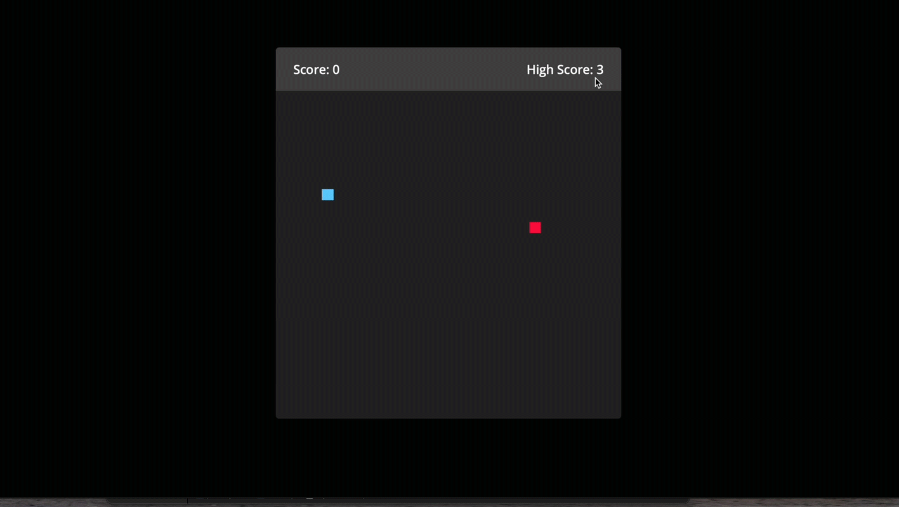

<h1>Snake Game</h1>

This project brings the classic Snake Game to the web browser. Players control the snake using keyboard arrow keys and aim to eat randomly placed food to grow the snake. The objective is to achieve the highest score by growing the snake as long as possible. This project is built using HTML, CSS, and JavaScript, providing a simple yet engaging gaming experience.

<h2>Features</h2>

<list>

- Snake and Food: Navigate the snake using arrow keys and consume randomly placed food.

- Scoring System: Earn points for each piece of food consumed. The highest score achieved is saved.

- High Score: The highest score obtained during gameplay is stored and displayed using local storage.

- Game Over: The game ends if the snake collides with itself or the boundaries, displaying an alert message.

- Responsive Design: The game is designed to adapt to different screen sizes.

</list>

<h2>Preview:</h2>

